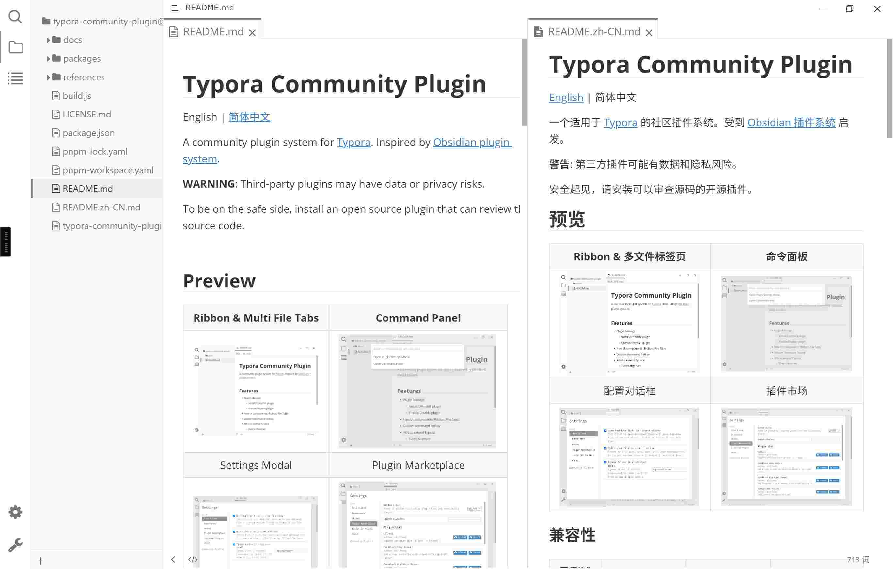
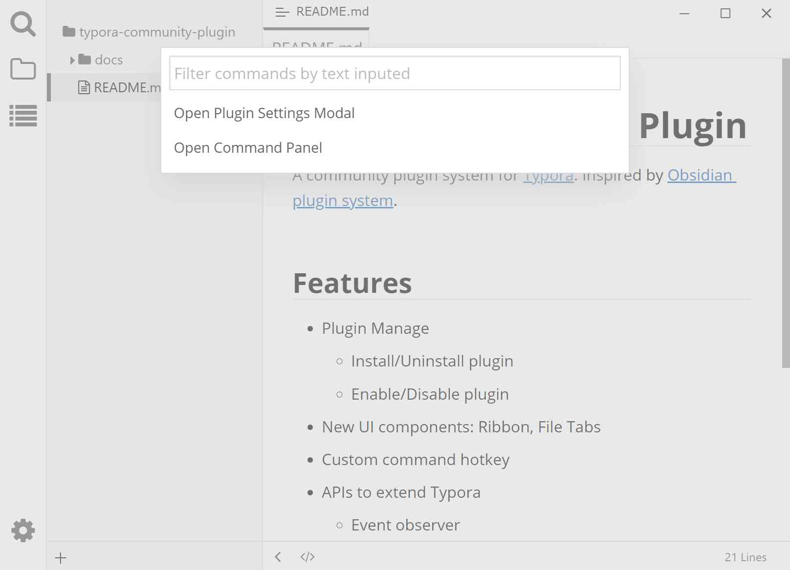
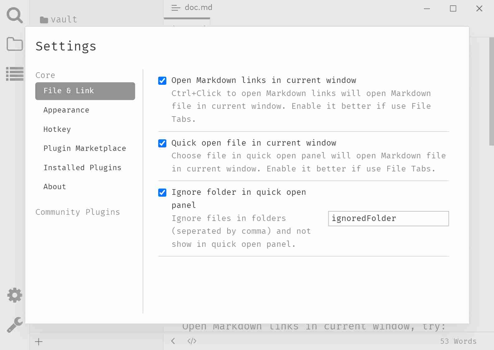
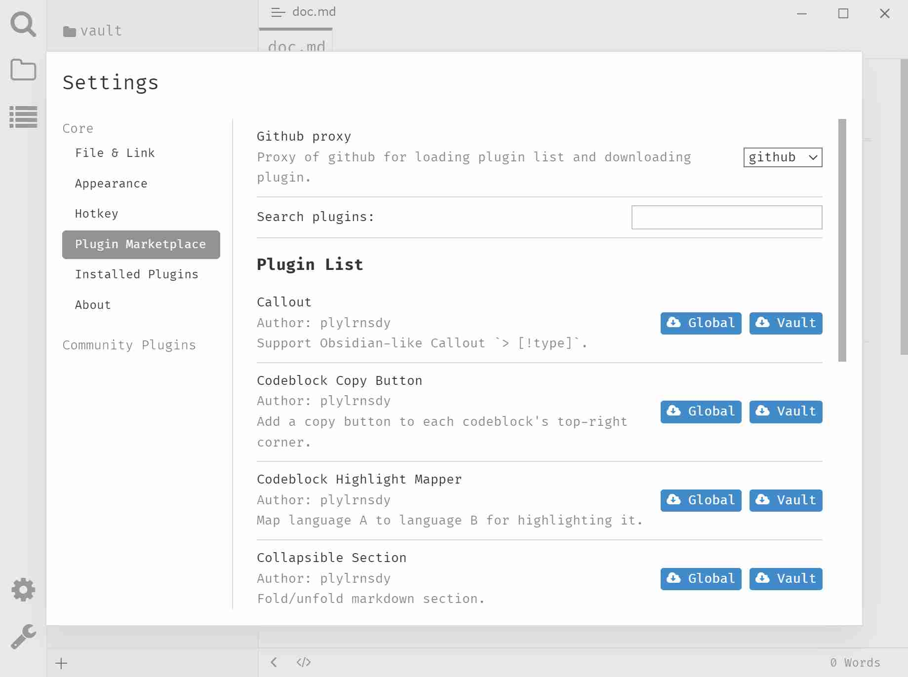

# Typora Community Plugin

English | [简体中文](./README.zh-CN.md)

A community plugin system for [Typora](https://typora.io/). Inspired by [Obsidian plugin system](https://docs.obsidian.md/Home).

**WARNING**: Third-party plugins may have data or privacy risks.

To be on the safe side, install an open source plugin that can review the source code.

## Preview

| Ribbon & Workspace                    | Command Panel                             |
| :-----------------------------------: | :---------------------------------------: |
|            |       |
| Settings Modal                        | Plugin Marketplace                        |
|  |  |

### Compatibility

| Tested |                  |                  |                     |
| :----: | ---------------- | ---------------- | ------------------- |
| Typora | v1.1.x - v1.14.x | v1.5.x - v1.12.x | v1.4.8 - v1.14.x    |
| OS     | Windows 10       | Ubuntu 22        | macOS 10.13, 14, 15, 26 |

## Features <small>([CHANGELOG](./docs/en-us/user-guide/CHANGELOG.md))</small>

- [Plugin Management](./docs/en-us/user-guide/2-plugin-installation.md)
  - [x] Install/Uninstall/Update plugin
  - [x] Enable/Disable plugin
- New UI components
  - [x] Command Panel
  - [x] [Ribbon](./docs/en-us/user-guide/4b-ribbon.md)
  - [x] [Workspace](./docs/en-us/user-guide/4a-workspace.md)
    - [x] (Virtual) Multi File Tabs
    - [x] Split View
    - [x] Side Panel `New`
    - [x] Floating View `New`
- [x] Custom command [hotkeys](./docs/en-us/user-guide/3c-hotkey.md)
- [x] [I18n](./docs/en-us/user-guide/5-i18n.md): follow system or manual configure, now support English, Chinese and German
- [x] Compatible with macOS
- [x] [Advanced Search](./docs/en-us/user-guide/4c-advanced-search.md): support expressions like `(book film) OR tag:game`

### Available Plugins

You can [install plugins](./docs/en-us/user-guide/2-plugin-installation.md) from the Plugin Marketplace:

| Plugins                              | Description                                               |
| ------------------------------------ | --------------------------------------------------------- |
| [abcjs][p12]                         | Use ABC music notation in codeblock.                      |
| [callout][p1]                        | Support Obsidian-like Callout `> [!type]`.                |
| [chat][p23] `New`       | Collaborate with AI to write notes.                       |
| [code-folding][p14]                  | Make your codes foldable.                                 |
| [codeblock-copy-button][p2]          | Add a copy button to each codeblock's top-right corner.   |
| [codeblock-highlight-mapper][p3]     | Map language A to language B for highlighting it.         |
| [codeblock-previewer-plus][p24] `New` | Preview codeblocks (e.g. mermaid) in floating view, with zoom and drag support |
| [collapsible-section][p4]            | Fold/unfold markdown section. Supports headings, list, codeblock, table, quoteblock, callout. |
| [darkmode][p13]                      | General dark mode for any theme.                          |
| [file-icon][p5]                      | Show different icon for different file type in file tree. |
| [footnotes][p18]                     | Footnote marker suggestion & Re-index the numerical footnotes. |
| [front-matter][p6]                   | Auto edit front matter, including creation time, editing time, etc. |
| [git][p25] `New`       | Commit Git commits within Typora.                         |
| [image-location][p15]                | Resolve image's location relative to vault's root.        |
| [image-viewer][p16]                  | View all the images in current Markdown.                  |
| [markmap][p11]                       | Support Markmap in codeblock.                             |
| [mini-outline][p26] `New` | Floating outline on the right side of the editor.        |
| [note-refactor][p7]                  | Extract selection to new file.                            |
| [note-snippets][p8]                  | Use slash command to autocomplete note snippets.          |
| [statistics][p22]                    | Display document statistics.                              |
| [styled-text][p21]                   | Add temporary styles to text matching regular expressions.|
| [tag][p9]                            | Highlight `#tag` syntax, autocomplete, tag panel management and search tags |
| [templater][p19]                     | Create notes from templates.                              |
| [trigger][p20]                       | Set a trigger for the command to execute automatically.   |
| [wavedrom][p17]                      | Support WaveDrom in codeblock.                            |
| [wikilink][p10]                      | Support wikilink like `[[text]]`, with autocomplete; embedding Markdown with syntax `![[wikilink]]` |

## User Documentation

- [How to install](./docs/en-us/user-guide/1a-installation.md)
- [Install plugin in Marketplace](./docs/en-us/user-guide/2-plugin-installation.md)
- [How to uninstall](./docs/en-us/user-guide/1b-uninstall.md)

### Default Hotkeys

| Hotkey                      | Function            |
| --------------------------- | ------------------- |
| <kbd>F1</kbd>               | Open Command Panel  |
| <kbd>Ctrl</kbd>+<kbd>.</kbd>| Open Settings Modal |

## Development Documentation

See [Development Documentation](./docs/en-us/dev-guide/0-dev-docs.md) or [Getting Started](./docs/en-us/dev-guide/1-getting-started.md)

## Contributing

Welcome to create pull requests.

## Support

If you have any problem or suggestion please open an issue [here](https://github.com/typora-community-plugin/typora-community-plugin/issues).

[p1]: https://github.com/typora-community-plugin/typora-plugin-callout
[p2]: https://github.com/typora-community-plugin/typora-plugin-codeblock-copy-button
[p3]: https://github.com/typora-community-plugin/typora-plugin-codeblock-highlight-mapper
[p4]: https://github.com/typora-community-plugin/typora-plugin-collapsible-section
[p5]: https://github.com/typora-community-plugin/typora-plugin-file-icon
[p6]: https://github.com/typora-community-plugin/typora-plugin-front-matter
[p7]: https://github.com/typora-community-plugin/typora-plugin-note-refactor
[p8]: https://github.com/typora-community-plugin/typora-plugin-note-snippets
[p9]: https://github.com/typora-community-plugin/typora-plugin-tag
[p10]: https://github.com/typora-community-plugin/typora-plugin-wikilink
[p11]: https://github.com/typora-community-plugin/typora-plugin-markmap
[p12]: https://github.com/typora-community-plugin/typora-plugin-abcjs
[p13]: https://github.com/typora-community-plugin/typora-plugin-darkmode
[p14]: https://github.com/typora-community-plugin/typora-plugin-code-folding
[p15]: https://github.com/typora-community-plugin/typora-plugin-image-location
[p16]: https://github.com/typora-community-plugin/typora-plugin-image-viewer
[p17]: https://github.com/typora-community-plugin/typora-plugin-wavedrom
[p18]: https://github.com/typora-community-plugin/typora-plugin-footnotes
[p19]: https://github.com/typora-community-plugin/typora-plugin-templater
[p20]: https://github.com/typora-community-plugin/typora-plugin-trigger
[p21]: https://github.com/typora-community-plugin/typora-plugin-styled-text
[p22]: https://github.com/typora-community-plugin/typora-plugin-statistics
[p23]: https://github.com/typora-community-plugin/typora-plugin-chat
[p24]: https://github.com/typora-community-plugin/typora-plugin-codeblock-previewer-plus
[p25]: https://github.com/typora-community-plugin/typora-plugin-git
[p26]: https://github.com/typora-community-plugin/typora-plugin-mini-outline
