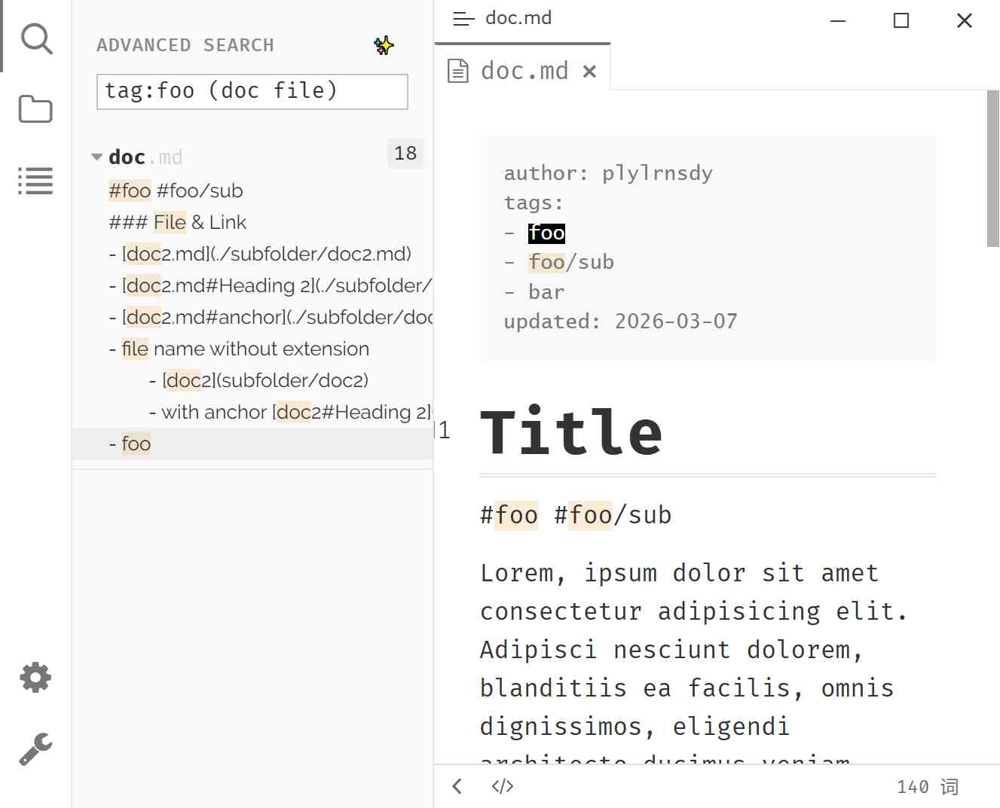

# Advanced Search

Advanced Search supports a structured query syntax (including field prefixes, boolean operators, and negation) — allowing you to precisely locate what you need across your entire vault.

## Preview



## Enable Advanced Search Mode

Advanced Search needs to be enabled manually:

1. Open the search panel (click the **Search** icon in the Ribbon)
2. Look for the toggle button <button class="ty-plugin-advanced-search-btn" style="display:inline-block; padding: 2px 8px; border: 1px solid #999; border-radius: 3px; cursor: pointer;">✨</button> next to the search box
3. Left-click to **enable/disable** Advanced Search mode

When enabled, the search box uses a ripgrep-based advanced parsing engine instead of Typora's native simple text matching.

## Query Syntax

### Basic Terms

Type a word or phrase in the search box. The search scans all files in your vault for matches.

```
hello world
```

Multiple bare words are implicitly **AND**-ed together by default — results must contain ALL terms.

For **exact phrase** matching, wrap text in double quotes:

```
"exact phrase"
```

### Field Prefixes

Use field prefixes to narrow searches to specific metadata fields:

| Prefix | Description | Example |
|--------|-------------|---------|
| `tag:` | Search by tags (inline `#` or YAML frontmatter `tags` array) | `tag:project` |
| `title:` | Search by file title or heading text | `title:Meeting` |
| `filename:` | Search by filename only (case-insensitive) | `filename:report` |

Field prefixes are **case-insensitive** — you can use any casing.

#### Tag Search Notes

| Query | Scope |
|-------|-------|
| `tag:foo` | Searches both frontmatter tags and body inline `#tag` |
| `#tag` | Only searches inline `#tag` in the body |
| `tag:foo -#tag` | Only searches tags in frontmatter (excludes body) |

Tag matching is **exact** — `tag:foo` will NOT match `foobar` or `my-foo`. Hierarchical tags are supported:

```
tag:project/sub-task
```

### Boolean Operators

#### AND (implicit)

Separate multiple terms with spaces for an "AND" effect that requires all of them:

```
meeting notes
```

This finds files containing both "meeting" and "notes".

#### OR (explicit)

Use uppercase `OR` to indicate an "or" relationship — matching either side of the query:

```
(book OR film) tag:movies
```

This finds files that contain "book" or "film", AND have the tag "movies".

Parentheses are used for precedence and grouping.

#### NOT (negation)

Prefix any term or group with `-` to exclude it:

```
tag:project -deprecated
```

This finds files tagged as "project" but **NOT** containing "deprecated".

Negated groups are also supported:

```
(tag:work OR tag:personal) -(meeting OR call)
```

### Combining Everything

All features can be combined in a single query. Here's an example from the changelog:

```
(book film) OR tag:game
```

This finds files that contain both "book" and "film", OR have the tag "game".

## Limitations

- The `OR` operator must be uppercase; lowercase "or" is treated as a regular word
- Queries are limited to files up to 2MB in size
- Negation (`-`) applies only to the term or group it prefixes, not globally
