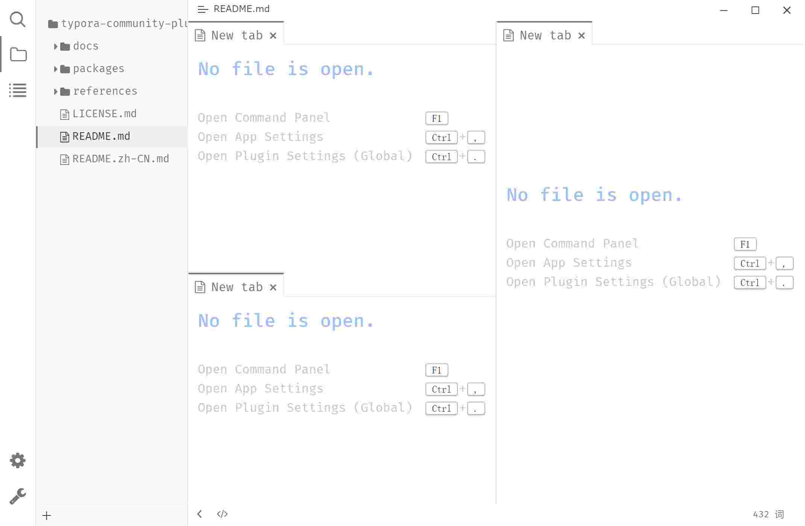

# Workspace

## Features

**Multiple Tabs**: Similar to browser tabs, it can simulate opening multiple files.

> It is recommended to enable "Application Settings → General → Automatically save changes to the previous file when switching files."

**Split View**: Open multiple views (multiple files) at the same time.

## Preview

## Usage

### Open Markdown Preview in Split View

In the file tree, right-click on any file, and in the context menu that pops up, click "Open on the Right", which will split the workspace and open the file preview on the right.

### Manual Split View

1. Use the shortcut <kbd>F1</kbd> to open the command palette, select "Workspace: Split Right" or "Workspace: Split Down";
2. Drag the tab to another panel.

## Configuration

### Enable/Disable Workspace

Use the shortcut <kbd>Ctrl</kbd>+<kbd>.</kbd> to open the "Plugin Settings" modal → "Core Plugins" tab → check/uncheck "Workspace" to enable/disable the workspace.

### Workspace Settings

More configuration options for the workspace can be viewed and managed in the "Plugin Settings" modal → "Core Plugin" → "Workspace" tab:

1. **Hide file extensions in tab labels**: For example, the tab label "File.md" will display as "File";
2. **Show blank New Tab**: Display a blank page when creating a new tab (instead of the recently accessed page);
3. **Toggle editor and preview on click of preview area**: Clicking the preview area switches it to the Typora editor, while simultaneously switching the current editor to preview (enabled by default).
