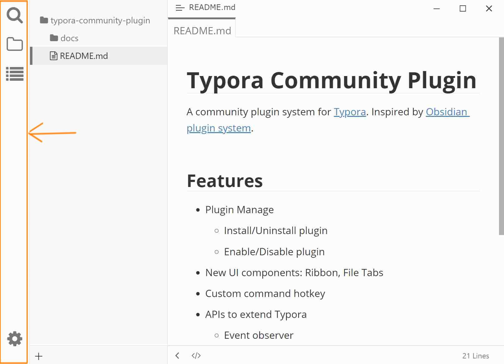

# Ribbon (Activity Bar)

Inspired by VSCode, the Ribbon allows you to switch between different sidebar panes, including built-in panes (File Tree, Search, Outline) and custom panes provided by plugins (such as [tag][]).

## Preview

## Usage

### Switching Panes

- **Left-click** an icon to toggle and display the corresponding sidebar pane
- The currently active icon will be highlighted

### Managing Icon Visibility

Right-click anywhere on the Ribbon area to open a context menu. From the list, you can toggle each icon's visibility (show/hide). Hidden icons will no longer appear on the Ribbon.

### Rearranging Icons

Drag an icon up or down to change its order within the Ribbon. The new order is saved automatically.

## Settings Button

A **gear icon** 🛠️ at the bottom of the Ribbon provides quick access:

- Click the gear icon to open a menu
  - **"App Settings"** — Jump to Typora's native settings page
  - **"Plugin Settings"** — Open the community plugin configuration dialog (equivalent to <kbd>Ctrl</kbd>+<kbd>.</kbd>)

## Configuration

Use the shortcut <kbd>Ctrl</kbd>+<kbd>.</kbd> to open the "Plugin Settings" dialog → go to the "Appearance" tab → under "Advanced Options", check or uncheck **"Show Ribbon"** to show or hide the entire Ribbon.

[tag]: https://github.com/typora-community-plugin/typora-plugin-tag
