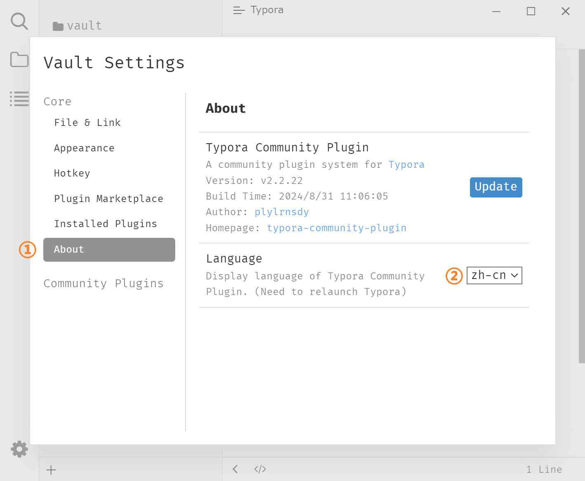

# 如何安装

### 脚本安装

1. 从 [Release][release] 下载 `typora-community-plugin.zip`。
2. 解压文件。
3. 以管理员身份运行 `install.ps1` (只适用于 Windows)。

### 手动安装

**Windows 用户**

1. 从 [Release][release] 下载 `typora-community-plugin.zip`。
2. 解压文件。
3. 复制文件到 `%UserProfile%/.typora/community-plugins`。
   > `%UserProfile%` 即用户目录 `C:\Users\{用户名}\`
4. 创建文件夹的符号链接。以管理员身份运行 `cmd` ，然后运行命令 `mklink /d %UserProfile%\\AppData\\Roaming\\Typora\\plugins %UserProfile%\\.typora\\community-plugins`。
5. 备份文件 `{Typora 安装目录}/resources/window.html`。（如果修改不成功，需要还原文件后再次尝试修改）
6. 修改文件 `{Typora 安装目录}/resources/window.html`。使用 UTF-8 编码（否则会[白屏][ws]）打开文件 `window.html`，替换文件末尾的文本 `</body></html>` 为 `</body></html>`。

**Linux 用户**

1. 从 [Release][release] 下载 `typora-community-plugin.zip`。
2. 解压文件。
3. 复制文件到 `~/.config/Typora/plugins`。
4. 备份文件 `/usr/share/typora/resources/window.html`。（如果修改不成功，需要还原文件后再次尝试修改）
5. 修改文件 `/usr/share/typora/resources/window.html`。使用 UTF-8 编码（否则会[白屏][ws]）打开文件 `window.html`，替换文件末尾的文本 `</body></html>` 为 `</body></html>`。

**macOS 用户**

1. 从 [Release][release] 下载 `typora-community-plugin.zip`。
2. 解压文件。
3. 复制文件到 `/Users/{UserName}/Library/Application Support/abnerworks.Typora/plugins`（如果不存在`plugins`文件夹，请手动创建）
4. 右键 `Typora.app`，点击“显示包内容”，进入应用内部文件夹。
5. 备份文件 `Typora.app/Contents/Resources/TypeMark/index.html`。（如果修改不成功，需要还原文件后再次尝试修改）
6. 修改文件 `Typora.app/Contents/Resources/TypeMark/index.html`。使用 UTF-8 编码（否则会[白屏][ws]）打开文件 `index.html`，替换文件末尾的文本 `</body>` 为 `</body>`，其中 `{UserName}` 需要替换为你的 macOS 账号名。

**PS:** 安装成功后，默认显示 [活动栏](./3-ribbon.md) 和 [多文件标签页](./3-file-tabs.md)。可以在设置中手动隐藏。

### 安装失败

安装后，没有显示活动栏和多文件标签页，请按以下步骤检查：

- 打开开发人员工具，检查是否有报错
  - Windows/Linux: 使用快捷键 <kbd>Shift</kbd>+<kbd>F12</kbd> 打开开发人员工具
  - macOS: 菜单栏“帮助” → “启用调试”，然后右键单击编辑区，选择“检查元素”，打开开发人员工具
- 如果有报错，请截图或复制日志，在 [Issues][issues] 中反馈。
- 如果没报错
  1. 修改 `loader.json` 文件中的 `"debug":false` 为 `"debug":true` ，然后重启 Typora
  2. 打开开发人员工具 Console 选项卡，在 Filter 输入框中输入 `core.js` 过滤日志
  3. 截图或复制日志，在 [Issues][issues] 中反馈。

### 切换中文语言

按下 <kbd>Ctrl</kbd>+<kbd>.</kbd> 打开插件设置对话框，在“About”选项卡 → “Language”下拉框中选择“zh-cn”，然后重启 Typora 即可。

[issues]: https://github.com/typora-community-plugin/typora-community-plugin/issues
[release]: https://github.com/typora-community-plugin/typora-community-plugin/releases
[ws]: https://github.com/typora-community-plugin/typora-community-plugin/issues/9
