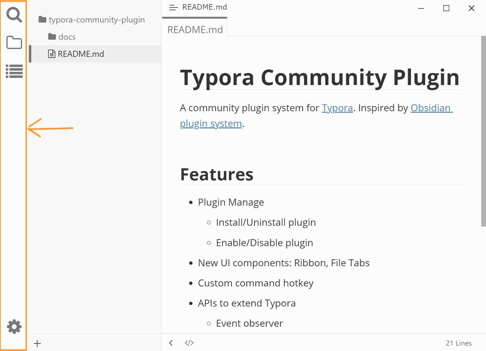

# 活动栏（Ribbon）

类似 VSCode 的活动栏，能够在不同侧栏面板间切换，包括内置面板（文件、搜索、大纲）和自定义面板（如插件 [标签][]）。

## 预览

## 配置

使用快捷键 <kbd>Ctrl</kbd>+<kbd>.</kbd> 打开“插件配置”对话框 → “外观”选项卡 → “高级选项”，勾选/反选“显示活动栏”可 显示/隐藏 活动栏。

[tag]: https://github.com/typora-community-plugin/typora-plugin-tag
