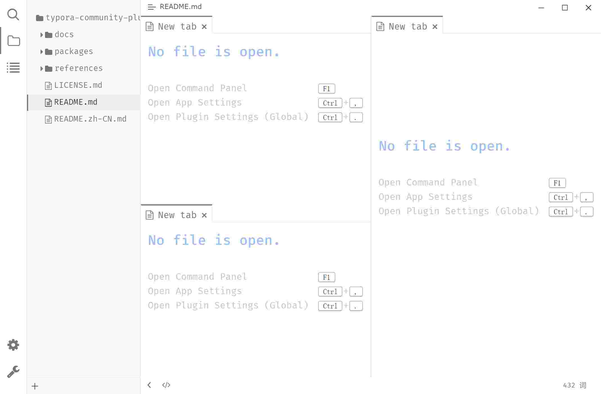

# 工作区（Workspace）

## 特性

**多标签**：类似浏览器的标签页，可以模拟打开多个文件。

> 推荐启用“应用设置 → 通用 → 切换文件时自动保存对上一个文件的更改”

**分屏**：同时打开多个视图（多个文件）

## 预览

## 用法

### 分屏打开 Markdown 预览

在文件树中，右键点击任意文件，在弹出的上下文菜单中，点击“在右侧打开”，将会左右分屏并在右侧打开文件预览。

### 手动分屏

1. 使用快捷键 <kbd>F1</kbd> 可以打开命令面板，选择 “Workspace: 右侧打开窗格” 或 “Workspace: 下方打开窗格”；
2. 拖动标签页到另一个窗格。

## 配置

使用快捷键 <kbd>Ctrl</kbd>+<kbd>.</kbd> 打开“插件配置”对话框 → “外观”选项卡 → “高级选项”，勾选/反选“使用工作区”可 启用/禁用 工作区。
